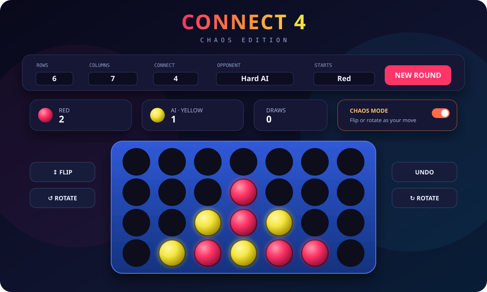

# Connect 4: Chaos Edition

A polished browser game that keeps classic Connect Four intact while adding configurable boards, four AI levels, and an optional **Chaos Mode** where flipping or rotating the board is a legal move.

[Play the game](https://senegrom.github.io/connect4-chaos/) · [View the source](https://github.com/senegrom/connect4-chaos)



## Highlights

- Classic two-player Connect Four or play against Easy, Medium, Hard, or Brutal AI.
- Board sizes from 4×4 to 10×10 and connect lengths from 3 to 6.
- Optional flip, clockwise rotation, and counter-clockwise rotation moves.
- Responsive, game-first layout with progressive setup controls and an in-page rules guide.
- Live AI depth, position count, elapsed time, and search-rate feedback.
- Undo that returns to the previous human decision in AI games.
- Keyboard, mouse, touch, reduced-motion, forced-colour, and screen-reader support.
- Persistent settings and match scores using local storage.
- No runtime dependencies, tracking, adverts, or external network calls.
- Pure game-engine and AI modules with automated tests and GitHub Actions CI.

## AI

The AI runs in a Web Worker, so deeper searches do not freeze the interface. Classic drop-only games use a specialised in-place search, while Chaos Mode retains the fully general transformation-aware search.

Strength improvements include:

- Iterative-deepening alpha-beta search with aspiration windows.
- Tactical horizon extensions for immediate wins, forced blocks, and double threats.
- Gravity-aware evaluation that distinguishes playable threats from floating shapes.
- Symmetry-aware transposition caching for classic boards.
- Principal-variation, killer-move, history, and centre-first move ordering.
- Reusable search information between completed depths.
- Repetition-aware search for Chaos Mode.

Medium completes 6 plies, Hard 9, and Brutal 12, with additional tactical extensions at the horizon. There is no wall-clock search cutoff: the worker finishes the selected depth unless the player explicitly cancels it by restarting, undoing, or changing the game.

## Chaos Mode rules

A flip or rotation consumes the current player's turn. After the transformation, gravity is applied downward in the board's new orientation.

- If the transformation creates a line for one player, that player wins.
- If it creates winning lines for both players, the player who transformed the board loses the tie.
- A full board without a winner is a draw.
- The same board position with the same player to move for a third time is a draw by repetition.

Rotating a non-square board swaps its row and column counts for the rest of that round.

## Controls

| Action | Mouse / touch | Keyboard |
| --- | --- | --- |
| Choose a column | Point at a cell or column marker | <kbd>←</kbd> / <kbd>→</kbd>, <kbd>Home</kbd>, <kbd>End</kbd> |
| Drop a piece | Click or tap | <kbd>Enter</kbd> / <kbd>Space</kbd> |
| Undo | Undo button | <kbd>U</kbd> |
| New round | New round button | <kbd>N</kbd> |
| Flip | Flip button | <kbd>F</kbd> |
| Rotate clockwise | Rotate right | <kbd>R</kbd> |
| Rotate counter-clockwise | Rotate left | <kbd>Shift</kbd> + <kbd>R</kbd> |

## Run locally

Node.js 22 or newer is recommended.

```bash
npm install
npm run dev
```

Open `http://127.0.0.1:4173`. A local server is needed during development because browsers restrict ES modules and Web Workers when an HTML file is opened directly from disk.

Run all checks:

```bash
npm run ci
```

An optional coverage report is available with `npm run test:coverage`.

## Project structure

```text
.
├── index.html              Semantic interface, metadata, and security policy
├── styles.css              Responsive visual design and animations
├── src/
│   ├── engine.js           Pure rules, gravity, wins, transforms, repetition keys
│   ├── ai.js               Evaluation and iterative-deepening alpha-beta searches
│   ├── ai-worker.js        Background AI entry point and progress messages
│   └── app.js              UI state, rendering, persistence, input, and undo
├── tests/
│   ├── engine.test.js      Rules and transform tests
│   ├── ai.test.js          Tactical, search, timeout, and mutation-safety tests
│   └── worker.test.js      Browser-worker protocol and progress test
└── scripts/serve.mjs       Dependency-free local static server
```

The rules engine does not depend on the DOM, which makes game behaviour deterministic and straightforward to test. UI state is kept separately, and gameplay actions produce new boards; the specialised classic AI mutates only its private search copy and restores it after every branch.

## Deployment

CI runs on every push and pull request. A successful push to `main` is automatically deployed to GitHub Pages.

## Origin

This project is a ground-up refactor of a single-file HTML prototype supplied by email. The visual direction and unusual flip/rotate mechanics were retained; the code was separated into maintainable modules and the game gained background AI, undo, persistence, accessibility improvements, tests, CI, and progressively stronger search.

## License

[MIT](LICENSE)
